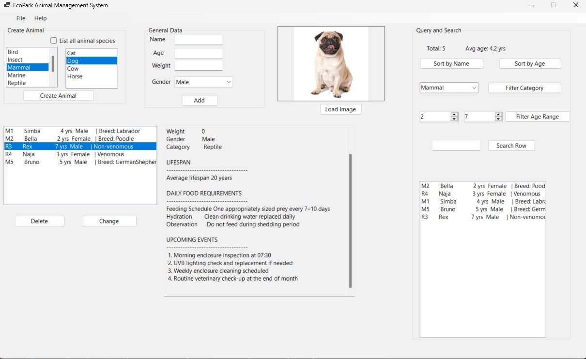

# EcoPark Animal Management System — Version 3

A Windows Forms application built in C# as part of the *Programming in C# II* course at Malmö University.
This version extends Version 2 with data persistence, exception handling, and LINQ-based querying.



---

## What's New in Version 3

- Save and load animals using plain text, JSON, and XML files
- LINQ queries — sort, filter, search, and aggregate animal data
- Custom exception class for duplicate validation before saving
- File menu with New, Open, Save, Save As, and Exit
- Query and Search panel showing live results and statistics

---

## Features

- Add, edit, and delete animals across multiple species
- Persistent storage across sessions via file save/load
- Filter animals by category or age range
- Search by name or ID
- Live stats — total count and average age
- Species-specific detail view with food schedule and upcoming events

---

## OOP Concepts Demonstrated

- Encapsulation — private fields with validated properties
- Inheritance — Animal → Mammal/Reptile → Dog/Snake
- Polymorphism — overridden methods per species
- Interfaces — `IAnimal`, `IListManager<T>`
- Generics — `ListManager<T>` manages any collection type
- Custom exceptions — `AnimalValidationException`
- LINQ — query syntax for sorting, filtering, searching, and validation

---

## File Formats Supported

| Format | Save | Load |
|--------|------|------|
| Plain text (.txt) | Yes | Yes |
| JSON (.json) | Yes | Yes |
| XML (.xml) | Yes | — |

---

## Technologies

- C# / .NET 9
- Windows Forms
- System.Text.Json
- System.Xml.Serialization

---

## Project Structure

```
EcoParkAnimalManagementSystem/
├── AnimalGen/          # Animal base class, enums
├── Exceptions/         # AnimalValidationException
├── Infrastructure/     # ListManager<T>, AnimalManager
├── Interfaces/         # IAnimal, IListManager<T>
├── Mammals/            # Mammal, MammalFactory, species
├── Reptiles/           # Reptile, ReptileFactory, species
├── Utilities/          # NumericUtility
├── Demo1.txt           # Demo data — plain text
├── Demo1.json          # Demo data — JSON
└── Demo1.xml           # Demo data — XML
```

---

*Malmö University — Programming in C# II — Assignment 3*
